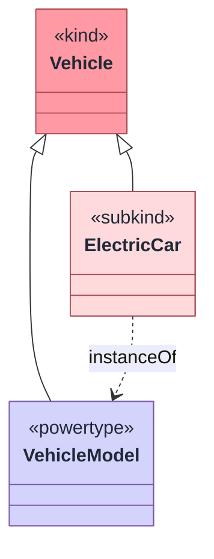
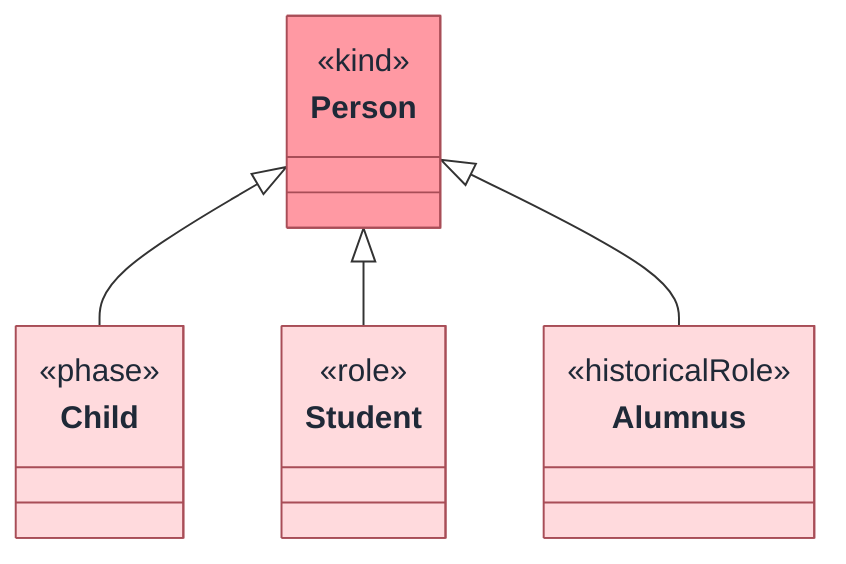

Tonto class declarations use OntoUML/UFO stereotypes as language keywords.

```tonto
kind Person
role Student specializes Person
category PhysicalObject of objects
```

## Declaration shape

```text
<stereotype> <Name> of <nature1>, <nature2> (instanceOf <Type>) specializes <Parent1>, <Parent2> {
  label { @en "..." }
  description { @en "..." }
}
```

All parts after the name are optional. Choose the most precise stereotype you can.

Example with the optional parts in their grammar order:

```tonto
kind Vehicle
powertype VehicleModel specializes Vehicle

subkind ElectricCar (instanceOf VehicleModel) specializes Vehicle {
  label { @en "Electric car" }
  description { @en "A car whose propulsion is supplied by electric motors." }
}
```

Diagram convention: specialization uses UML generalization notation. The hollow triangle points to the most general type, which is shown above the more specific types.



## Ultimate sortals

Ultimate sortals provide or specialize identity principles.

| Stereotype | Use for |
| --- | --- |
| `kind` | Functional complexes, such as `Person`, `Car`, or `Organization`. |
| `collective` | Collections with members, such as `Team` or `Fleet`. |
| `quantity` | Amounts of matter, such as `WaterPortion`. |
| `quality` | Measurable qualities, such as `Weight` or `Color`. |
| `mode` | Intrinsic moments that are not modeled as values. |
| `intrinsicMode` | Explicit intrinsic mode. |
| `extrinsicMode` | Explicit externally dependent mode. |
| `relator` | Truth-makers of material relations, such as `Employment`. |
| `type` | Higher-order types whose instances are types. |
| `powertype` | Powertypes over possible specializations of a base type. |

Example:

```tonto
kind Person
relator Enrollment
type CourseLevel
```

## Base sortals

Base sortals inherit identity from exactly one ultimate sortal.

| Stereotype | Rigidity | Example |
| --- | --- | --- |
| `subkind` | Rigid | `subkind Employee specializes Person` when every employee in scope is essentially an employee. |
| `phase` | Anti-rigid, intrinsic | `phase Child specializes Person`. |
| `role` | Anti-rigid, relational | `role Student specializes Person`. |
| `historicalRole` | Anti-rigid, event-based | `historicalRole FormerStudent specializes Person`. |

```tonto
kind Person

phase Child specializes Person
role Student specializes Person
historicalRole Alumnus specializes Person
```



`Child`, `Student`, and `Alumnus` all inherit the identity principle supplied by `Person`; their stereotypes explain why membership can change over time.

## Non-sortals

Non-sortals classify instances that can belong to multiple kinds.

| Stereotype | Meaning |
| --- | --- |
| `category` | Rigid common properties across kinds. |
| `mixin` | Semi-rigid properties. |
| `phaseMixin` | Anti-rigid intrinsic properties across kinds. |
| `roleMixin` | Anti-rigid relational properties across kinds. |
| `historicalRoleMixin` | Event-based historical properties across kinds. |

Non-sortals should usually declare an ontological nature:

```tonto
category PhysicalObject of objects
roleMixin Customer of functional-complexes, collectives
```

```mermaid
flowchart TB
  PhysicalObject:::tontoFunctionalComplex["PhysicalObject<br/>(category of objects)"]
  Customer:::tontoFunctionalComplex["Customer<br/>(roleMixin of functional-complexes, collectives)"]
  Person:::tontoKind["Person<br/>(kind)"]
  Organization:::tontoKind["Organization<br/>(kind)"]

  Person -->|"classified by"| PhysicalObject
  Person -->|"classified by"| Customer
  Organization -->|"classified by"| Customer

  classDef tontoKind fill:#FF99A3,stroke:#A84D57,color:#1F2937
  classDef tontoFunctionalComplex fill:#FFDADD,stroke:#A84D57,color:#1F2937
```

Use non-sortals when the classification is shared across multiple identity providers. If the concept applies only under one `kind`, a `role`, `phase`, or `subkind` is usually clearer.

## Perdurants

Tonto also supports non-endurant stereotypes:

| Stereotype | Use for |
| --- | --- |
| `event` | Occurrences that unfold in time. |
| `situation` | States of affairs at a time. |
| `process` | Ongoing perdurants. |

```tonto
event EnrollmentCeremony
situation RegistrationOpen
process CourseDelivery
```

## Ontological natures

Use `of` to restrict possible natures:

```tonto
category SocialEntity of functional-complexes, relators
roleMixin ServiceProvider of objects
```

Supported natures:

```text
objects
functional-complexes
collectives
quantities
relators
intrinsic-modes
extrinsic-modes
qualities
events
situations
types
abstract-individuals
```

## Validation expectations

Tonto validators check common OntoUML constraints:

- Ultimate sortals should not specialize other ultimate sortals.
- Sortals should specialize exactly one ultimate sortal directly or indirectly.
- Rigid types should not specialize anti-rigid types.
- Explicit natures should be compatible and non-redundant.
- Duplicate declarations and circular specializations are reported.

Use `class` only as a temporary placeholder. It is useful during rough modeling but should be replaced before publication.
