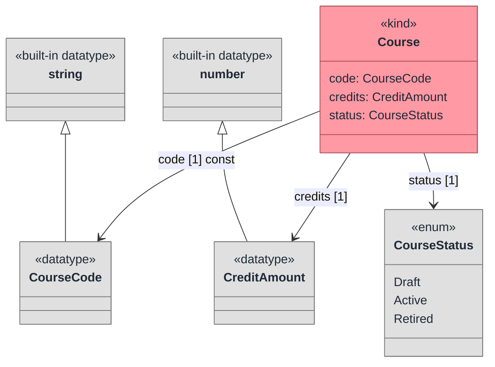

Tonto supports built-in datatypes and lets you define domain-specific datatypes and enums.

## Built-in datatypes

The built-in datatype names are:

```text
string
number
boolean
date
time
datetime
```

## Custom datatypes

```tonto
datatype Address {
  street: string [1]
  city: string [1]
  postalCode: string [0..1]
}

datatype Integer specializes number
```

Datatypes may specialize other datatypes or classes when the model requires it.

## Enums

```tonto
enum EyeColor {
  Blue,
  Green,
  Brown,
  Black
}
```

Enums can be used as attribute types:

```tonto
kind Person {
  eyeColor: EyeColor [0..1]
}
```

## Domain value example

Use custom datatypes and enums when the value has domain meaning beyond a primitive type.

```tonto
package university.academic

datatype CourseCode specializes string
datatype CreditAmount specializes number

enum CourseStatus {
  Draft,
  Active,
  Retired
}

kind Course {
  code: CourseCode [1] { const }
  credits: CreditAmount [1]
  status: CourseStatus [1]
}
```



## Attributes

Attributes use name, type, cardinality, and optional meta-properties:

```tonto
kind Person {
  name: string [1]
  preferredNames: string [1..*] { ordered }
  birthDate: date [1] { const }
  age: number [1] { derived }
}
```

## Cardinalities

| Syntax | Meaning |
| --- | --- |
| `[1]` | Exactly one. |
| `[0..1]` | Optional. |
| `[*]` | Zero or more. |
| `[1..*]` | One or more. |
| `[2..5]` | Bounded range. |

When no cardinality is written, treat the attribute as conceptually singular and prefer adding `[1]` for clarity.

## Attribute meta-properties

| Meta-property | Meaning |
| --- | --- |
| `ordered` | Values have a meaningful order. |
| `const` | Value should not change during the lifetime of the instance. |
| `derived` | Value can be derived from other facts. |

Meta-properties can be combined:

```tonto
kind Course {
  calculatedScores: number [0..*] { ordered derived }
}
```

Use `ordered` only when the order is part of the domain semantics. A set of prerequisites is usually unordered; a ranked list of attempts or preferred names may be ordered.

## Labels and descriptions

Labels and descriptions support language tags:

```tonto
kind Person {
  label {
    @en "Person"
    @pt-br "Pessoa"
  }

  description {
    @en "A human being considered as an individual."
    @pt-br "Um ser humano considerado como individuo."
  }
}
```

Use labels for display names and descriptions for modeling intent. Keep descriptions conceptual, not implementation-specific.

Inside a class or datatype body, write `label` and `description` before attributes and internal relations. That order follows the current grammar and keeps generated documentation stable.

## Practical conventions

- Use `UpperCamelCase` for classes, datatypes, and enums.
- Use `lowerCamelCase` for attributes.
- Prefer precise datatypes over generic `string` when the domain value has structure.
- Add labels and descriptions to public or reusable ontology packages.
