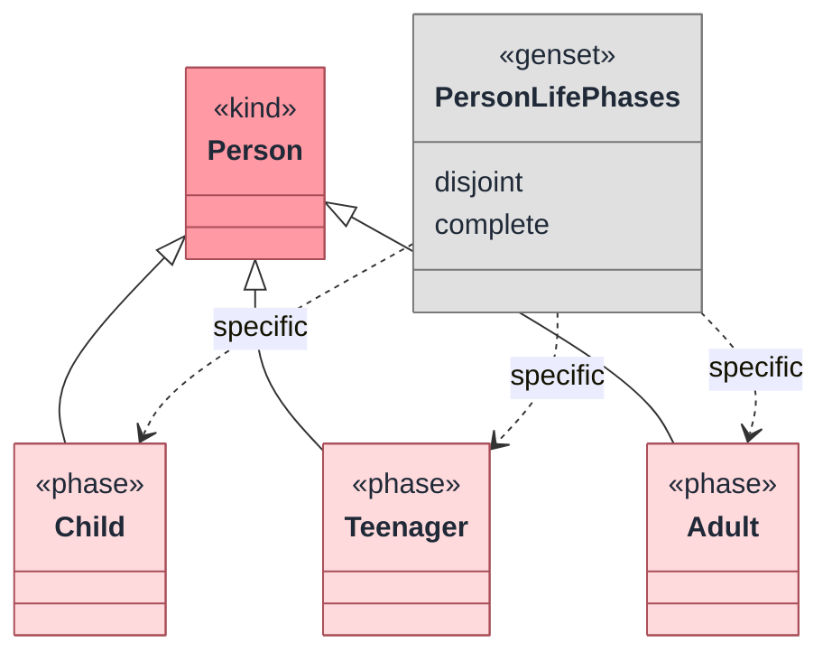
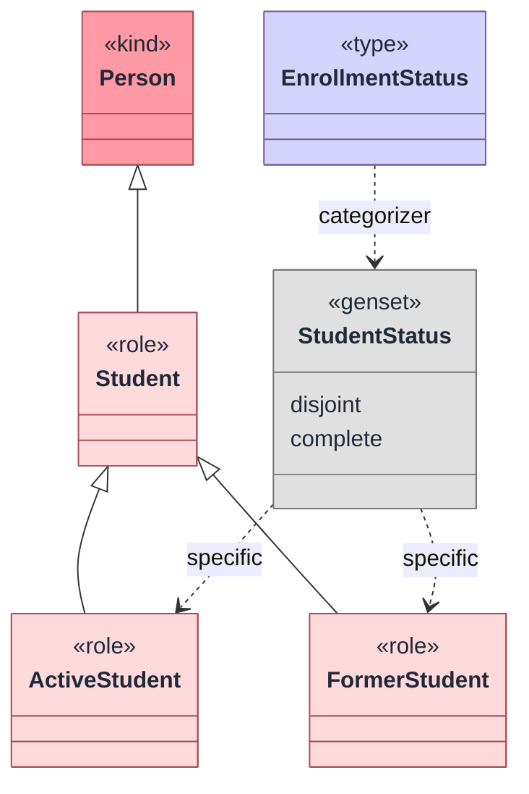
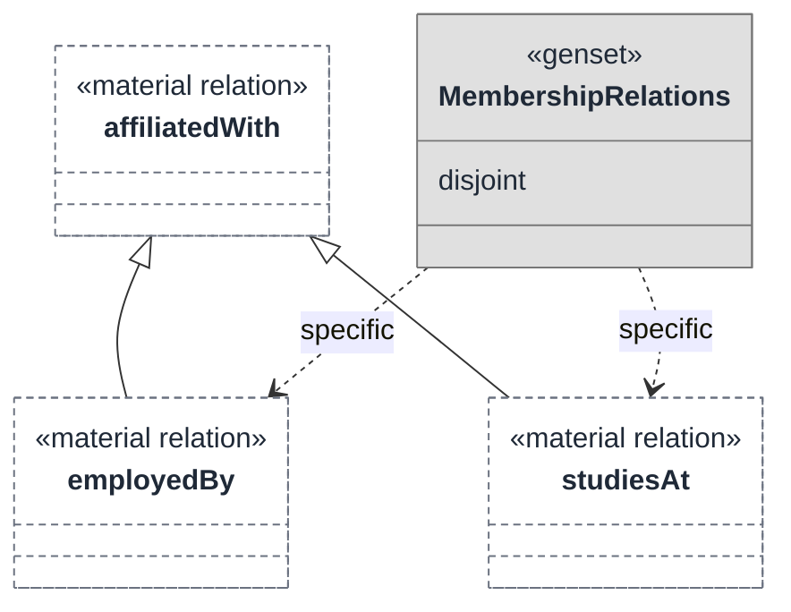

Generalization sets group specializations under a general element. They can be marked `disjoint`, `complete`, both, or neither.

## Short syntax

Use short syntax when the set is direct:

```tonto
kind Person

phase Child specializes Person
phase Teenager specializes Person
phase Adult specializes Person

disjoint complete genset PersonLifePhases where Child, Teenager, Adult specializes Person
```

This declares that `Child`, `Teenager`, and `Adult` specialize `Person` as one complete and disjoint partition.



## Block syntax

Use block syntax when you want a clearer multi-line form or a categorizer:

```tonto
kind Person
type EnrollmentStatus

role Student specializes Person
role ActiveStudent specializes Student
role FormerStudent specializes Student

disjoint complete genset StudentStatus {
  general Student
  categorizer EnrollmentStatus
  specifics ActiveStudent, FormerStudent
}
```

The `categorizer` field is optional.



## Generalizing relations

The grammar also allows generalization sets over class declarations or relations:

```tonto
kind Person
kind Organization

@material relation Person [0..*] -- affiliatedWith -- [0..*] Organization
@material relation Person [0..*] -- employedBy -- [0..1] Organization specializes affiliatedWith
@material relation Person [0..*] -- studiesAt -- [0..1] Organization specializes affiliatedWith

disjoint genset MembershipRelations where employedBy, studiesAt specializes affiliatedWith
```

Use this only when relation specialization is part of the intended ontology.



## Modeling guidance

- Use `disjoint` when instances cannot be classified by more than one specific at the same time.
- Use `complete` when the specifics cover all instances of the general in the model scope.
- Name generalization sets after the partitioning criterion, such as `PersonLifePhases`.
- Do not mark a set complete unless the domain really commits to exhaustive coverage.
