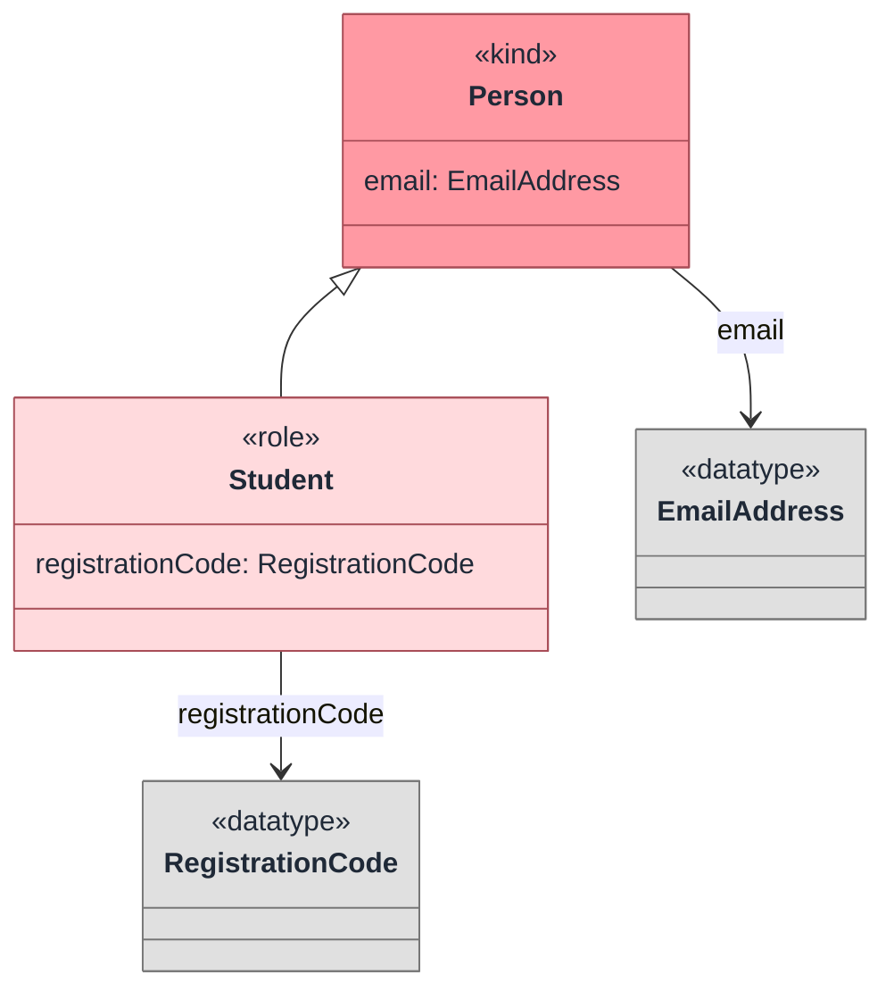

Packages are namespaces for model elements. Imports make declarations from other packages available in the current file.

## Package declarations

Use the `package` keyword followed by a qualified name:

```tonto
package university.people

kind Person
role Student specializes Person
```

The grammar also accepts `global package`:

```tonto
global package core.datatypes

datatype EmailAddress specializes string
```

Use global packages for foundational elements that should be available broadly in a project.

## Imports

Import another package by qualified name:

```tonto
import core.datatypes

package university.people

kind Person {
  email: EmailAddress [0..1]
}
```

Use aliases to make cross-package references clearer:

```tonto
import core.people as people

package university.academic

role Student specializes people.Person
```

## Two-file example

In practice, each file normally declares one package and imports the packages it reuses.

```tonto
// src/core/datatypes.tonto
global package core.datatypes

datatype EmailAddress specializes string
datatype RegistrationCode specializes string
```

```tonto
// src/university/people.tonto
import core.datatypes

package university.people

kind Person {
  email: EmailAddress [0..1]
}

role Student specializes Person {
  registrationCode: RegistrationCode [1] { const }
}
```



The import makes `EmailAddress` and `RegistrationCode` available to `university.people`. The `global package` modifier is useful for project-wide foundational declarations, but normal imports are still clearer for reusable domain packages.

## Recommended layout

Use one package per file for clarity:

```text
src/
  core/
    datatypes.tonto
    people.tonto
  university/
    academic.tonto
    organization.tonto
```

The folder layout is only organizational. The package name is defined by the `package` declaration, not by the directory path.

## Names

Package and element references use qualified names:

```tonto
import shared.identity

package billing.accounts

kind Customer specializes shared.identity.Person
```

Prefer stable, domain-oriented package names. Avoid using generated output folders or dependency folders as source roots.

## Statement order

The grammar is statement-based, but the readable convention is:

1. Imports first.
2. Package declaration next.
3. Datatypes and enums.
4. Classes and relations.
5. Generalization sets.

Following this order improves editor completion and makes model review easier.
