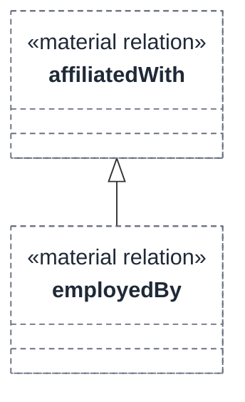
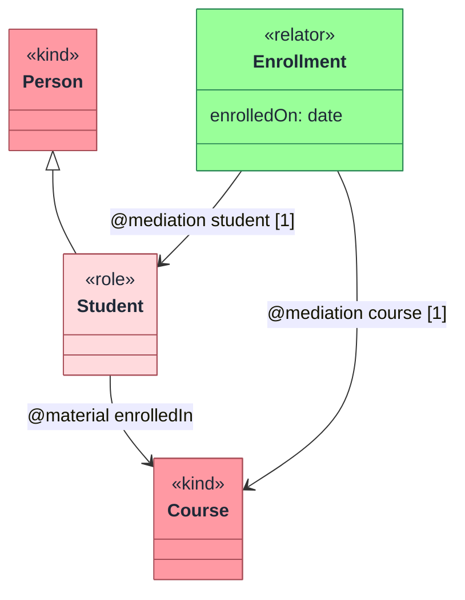

Relations connect classes, datatypes, and other relations.

## External relations

External relations begin with the optional stereotype, then `relation` and the source end:

```tonto
@mediation relation Enrollment [1] -- enrolls -- [1] Student
```

The general shape is:

```text
@<stereotype> relation <Source> (<sourceEndMeta>)? <sourceCardinality>? <connector> <name>? -- <targetCardinality>? (<targetEndMeta>)? <Target>
```

For a named association, read the source first, then the connector, relation name, target cardinality, and target type:

```tonto
kind Person
kind Course

@material relation Person [0..*] -- enrolledIn -- [0..*] Course
```

```mermaid
flowchart LR
  Person:::tontoKind["Person"]
  Course:::tontoKind["Course"]

  Person -->|"enrolledIn [0..*] to [0..*]"| Course

  classDef tontoKind fill:#FF99A3,stroke:#A84D57,color:#1F2937
```

## Internal relations

Internal relations are declared inside a class body. The enclosing class is the source:

```tonto
kind University {
  @componentOf [1] <o>-- hasDepartments -- [1..*] Department
}

kind Department
```

Internal relations are useful when one element naturally owns the relation in the model text.

```mermaid
flowchart LR
  University:::tontoKind["University"]
  Department:::tontoKind["Department"]

  University -->|"hasDepartments [1..*]<br/>composition"| Department

  classDef tontoKind fill:#FF99A3,stroke:#A84D57,color:#1F2937
```

## Connectors

| Connector | Meaning |
| --- | --- |
| `--` | Association. |
| `<>--` | Aggregation with diamond at the source side. |
| `<o>--` | Composition with diamond at the source side. |
| `--<>` | Aggregation with diamond at the target side. |
| `--<o>` | Composition with diamond at the target side. |

## Relation stereotypes

Tonto recognizes common OntoUML relation stereotypes:

```text
material
derivation
comparative
mediation
characterization
externalDependence
componentOf
memberOf
subCollectionOf
subQuantityOf
instantiation
termination
participational
participation
historicalDependence
creation
manifestation
bringsAbout
triggers
composition
aggregation
inherence
value
formal
constitution
```

Custom identifiers and string stereotypes are also accepted by the grammar, but use standard stereotypes when possible so validators and generators can preserve meaning.

## End names and end metadata

Relation ends can declare metadata and names:

```tonto
kind Course {
  ({ ordered } primaryCourse) [1] -- hasSessions -- [1..*] ({ ordered } sessions) ClassSession
}

kind ClassSession
```

Supported end metadata:

```text
ordered
const
derived
subsets <relationEnd>
redefines <relationEnd>
```

Example:

```tonto
kind University {
  [1] <o>-- hasUnits -- [1..*] (organizationalUnits) OrganizationalUnit
  [1] <o>-- hasDepartments -- [1..*] ({ subsets organizationalUnits } departments) Department
}

kind OrganizationalUnit
kind Department specializes OrganizationalUnit
```

End metadata appears before the cardinality of the first end and after the cardinality of the second end. In the example, `departments` is a named target end that subsets the broader `organizationalUnits` target end.

## Specialized and inverse relations

Relations can specialize another relation:

```tonto
kind Person
kind Organization

@material relation Person [0..*] -- affiliatedWith -- [0..*] Organization
@material relation Person [0..*] -- employedBy -- [0..1] Organization specializes affiliatedWith
```



Relations can also declare an inverse:

```tonto
@material relation Person [0..*] -- enrolledIn -- [0..*] Course inverseOf hasStudent
@material relation Course [0..*] -- hasStudent -- [0..*] Person inverseOf enrolledIn
```

## Relator pattern

Use relators as truth-makers for material relations:

```tonto
kind Person
kind Course

role Student specializes Person

relator Enrollment {
  enrolledOn: date [1] { const }
  @mediation [1] -- student -- [1] Student
  @mediation [1] -- course -- [1] Course
}

@material relation Student [0..*] -- enrolledIn -- [0..*] Course
```

This keeps the relation explicit and gives the model a place to attach attributes such as enrollment date or status.


