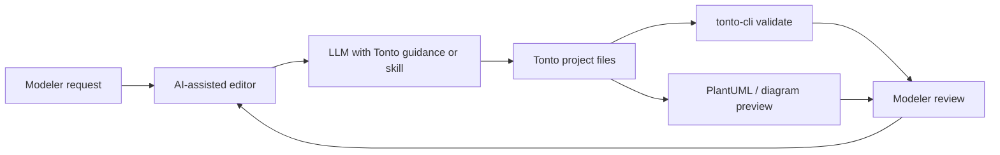

Tonto can be used with Large Language Model assistants because a Tonto ontology is a structured textual artifact. Assistants can read `.tonto` files, inspect packages and imports, propose edits, explain modeling decisions, and use Tonto validation feedback.

The goal is not to replace ontology modelers with an autonomous generator. The intended workflow is guidance-driven and human-in-the-loop: the LLM receives Tonto-specific guidance, proposes or explains changes, and the Tonto toolchain validates and visualizes the resulting model.

## Why Tonto works well with LLMs

Tonto was designed as a textual syntax for UFO-based OntoUML models. This matters for LLM assistance because:

- The model is plain text and can be included in prompts, diffs, reviews, and version control.
- Ontological commitments are explicit keywords such as `kind`, `phase`, `role`, `relator`, `event`, and `situation`.
- Packages and imports make model scope inspectable.
- The language server and CLI can report syntax and validation errors after an LLM proposes changes.
- PlantUML visualization can turn the textual model back into a diagram for inspection.

This combination lets the assistant work over a formal artifact instead of only over natural-language descriptions.

## Architecture

The LLM assistance workflow has four parts:

1. The user states a modeling goal in an AI-assisted environment such as Cursor, VS Code with Copilot, Codex, Claude Code, Gemini, or Antigravity.
2. The environment provides the LLM with the user request, relevant `.tonto` files, and the generated Tonto guidance or skill files.
3. The LLM proposes explanations, recommendations, patches, new files, or validation repair steps.
4. The modeler reviews the result, then Tonto validation and diagram generation are used to check the artifact.

## Supported task families

| Task family | What the assistant should do | Tonto grounding |
| --- | --- | --- |
| Create a new ontology | Propose an initial package structure, classes, relations, datatypes, and generalization sets from a domain description. | Packages, `tonto.json`, class declarations, relations, datatypes. |
| Enhance an existing ontology | Add new concepts while preserving existing packages, imports, naming conventions, and domain scope. | Existing `.tonto` files, imports, stereotypes, cardinalities. |
| Check terminology and stereotypes | Find unclear names, inconsistent vocabulary, weak stereotype choices, and possible UFO mismatches. | Class names, relation names, labels, descriptions, stereotypes. |
| Summarize a model | Explain a package or whole ontology in natural language without changing it. | Central `kind`s, `relator`s, taxonomies, package dependencies. |
| Generate documentation | Add or refine labels, descriptions, and explanatory comments for ontology elements. | `label`, `description`, and JSDoc-style comments. |
| Translate terminology | Add or refine multilingual labels and descriptions while preserving concept identity. | Language-tagged documentation blocks such as `@en` and `@pt-br`. |
| Repair validation errors | Use linter or CLI output to revise invalid syntax or modeling choices. | Tonto language server diagnostics and `tonto-cli validate`. |

## Design principles

- **Keep Tonto as the source of truth.** The assistant may explain or edit, but the ontology remains a Tonto project.
- **Use UFO and OntoUML terms precisely.** Stereotypes are ontological commitments, not decorative keywords.
- **Inspect before editing.** The assistant should read `tonto.json`, imports, package names, and nearby declarations before proposing changes.
- **Prefer reviewable changes.** Large hidden rewrites are risky; patches and rationale should be inspectable.
- **Validate and visualize.** LLM output is not correct just because it is fluent. Use Tonto diagnostics and diagrams.
- **Stay model-agnostic.** The guidance files are written for multiple LLM-enabled environments instead of one provider.

## What LLMs should not do

LLMs can accelerate modeling, but they cannot guarantee ontological correctness. They should not:

- Invent broad foundational concepts before checking existing packages and dependencies.
- Replace precise Tonto syntax with pseudocode or natural-language bullets.
- Treat `class` as a safe default when a more specific UFO category is required.
- Make destructive edits without first explaining the intended modeling change.
- Ignore validation feedback from the editor or CLI.

For setup instructions, see [guidance files](/llm-assistance/guidance-files) and [Tonto ontology skills](/llm-assistance/skills).
